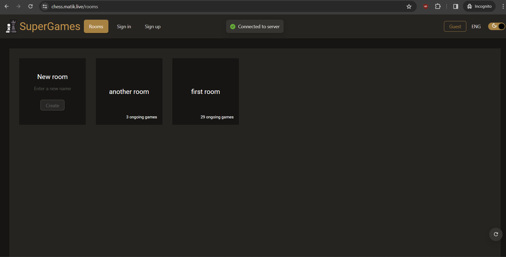
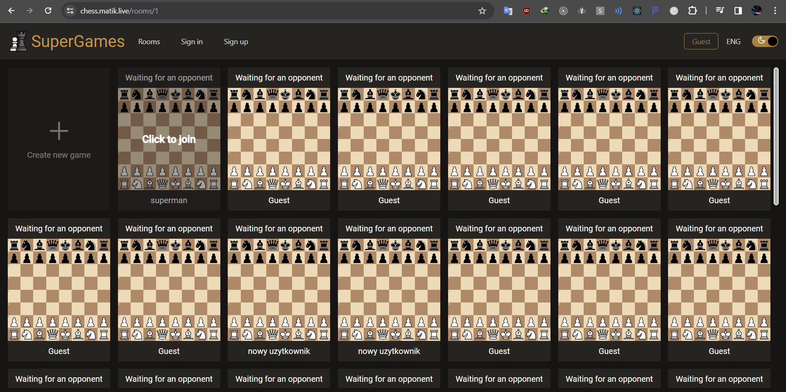
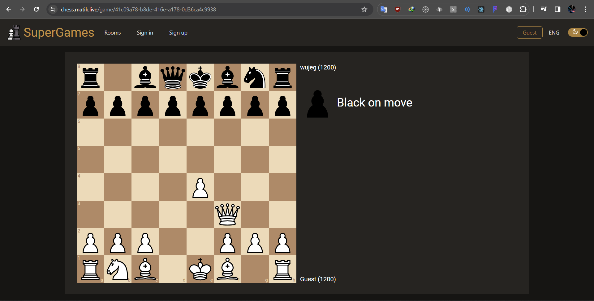

## SuperChess _by Mateusz Kisiel_

### Project's description:
The project is hosted at http://chess.matik.live/
It allows for the creation and joining of rooms which chess games are held. You can start a new game or join an existing one. Players can set any nickname without logging in. If we create an account and log in, we can also view our game history.

### Screenshots:

### Technical details
The project consists of a backend made in ASP.NET Core and a frontend in React. Data is stored in a PostgreSQL database. Communication is carried out through SignalR and Rest Api.
 
Before each commit, a precommit script is executed to check for errors in the frontend, and if any are found, it will prevent the commit. The project also includes a CircleCI pipeline that automatically builds and uploads a new version to the VPS after each push to the repository.
 
In the project https://github.com/matik001/VPSManager, you can find a script that automates the configuration of the VPS server. With two commands, you can automatically adapt the server for hosting the project.